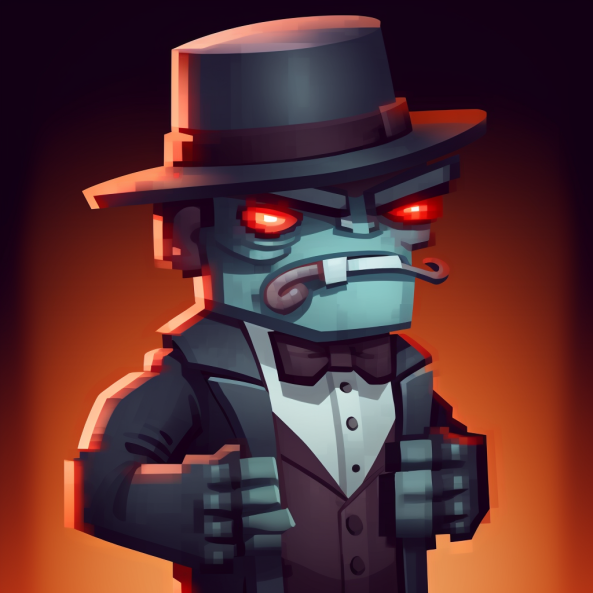

 

  
  <h3 align="center">discord.js Mafia Bot Clone</h3>
  

    A bot that hosts mafia games on your discord server!
  

## Instructions

* Have all your players type /join to join the party.
* Once there are at least 5 people, have the party leader type /setup for everyone to receive their roles through DM.
* When everyone is ready, type /start to play!
* Mafiabot creates a separate text channel on your server, where it will host the game!
* Through dms, the bot will prompt roles to choose their targets
* After all roles have finished their job, the bot will notify the group the outcome of the night and prompt everyone for votes to lynch someone.
* The person with the most vote will be lynched, and their role will be revealed.
* The cycle continues until the mafia side or the villager side wins.